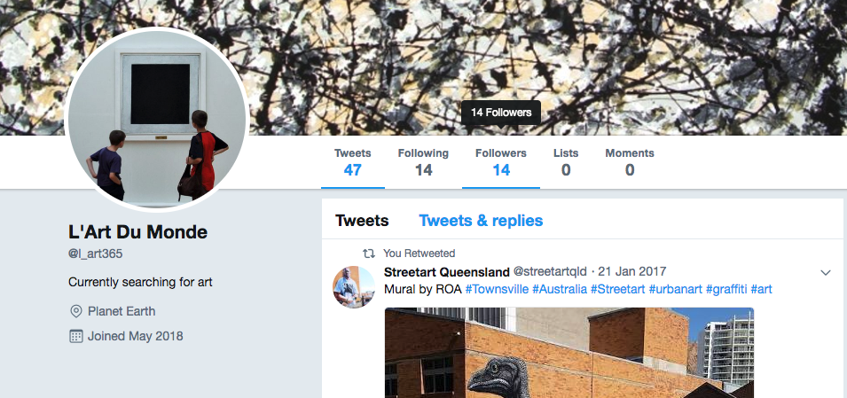

# Twitter Bot - Popularity Search
This Twitter Python Bot searches for the most popular art posts on twitter.
The bot searches for most retweeted and liked posts based on given hashtags associated with art. 
It collects the most popular posts for the past 24 hours in a dictionary and reposts the two most popular ones. 



## Getting Started

### Prerequisites
Library to install:
```
Tweepy
```
General Twitter Setup:
```
1. Create a Twitter account
2. Go to Twitter Application Management and Create an App
3. Obtain Tokens and Access Keys
```

### Set-Up
Place your obtained keys and tokens into `config.ini`
The script uses this part to obtian credentials:
```diff
    # load the key and secrets from the config file
    consumer_key = config['Twitter']['consumer_key']
    consumer_secret = config['Twitter']['consumer_secret']
    access_token = config['Twitter']['access_token']
    access_token_secret = config['Twitter']['access_token_secret']
```

## Usage
To call the script use:
```sh
$ python3 lart_bot.py config.ini
```

## Changing the Purpose of the Bot
This simple scipt can be extended to other functions of searching based on popularity. Since the bot's search scope is based on the provided hashtags,
one only needs to modify the `categories` list:
```
    categories = ["#streetart", "#art", "#contemporaryart", "#modernart", "#surrealism", "#impressionism", "#modernism",
                  "#popart", "#expressionism", "#cubism", "#realism", "#classicism", "#abstract"]
```

## Ways to Automate
The best way to automate this Twitter Bot is to use `AWS Lambda` with `cron` in order to specify how often should the script be executed. 

## Things to Consider
Twitter's `STANDARD API` has its rate limits. Be cautious of `GET` request as it has a limit of 180 calls per every 15 minutes. 
